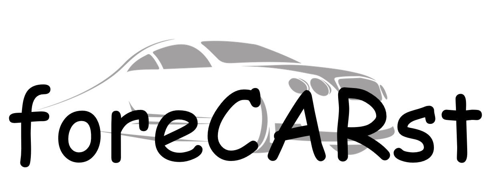

# The helping hand for car calculation!
## Brief summary of the project
Are you also annoyed when you want to calculate the cost of your car, that it is a huge effort to collect everything together from all fuel receipts, bills etc. to taxes and insurance expenses? Or even worse, do you even know how much you spend on your car? If you have lost track of all your expenses and upcoming expenses or if you need a simple application to replace your confusing Excel list with an extra on calculation of upcoming expenses, then foreCARst is the right website for you with a once created profile, easy direct input of expenses when they occur and a user-friendly interface we create maximum transparency for today’s and future expenses.

## Introduction
### What is the idea / background of the project?
Our project aims at the fact that most car drivers do not know how much they spend on their car per month and that they often have difficulties to estimate how the costs for their car will develop in the future. Our application is designed to help users to keep track of their costs for their car and also to make predictions about upcoming repairs, service etc.
Which specific problem should a solution be found for?
The concrete problem which we want to solve with our application is the complexity of the costs of a car, and to make the most predictable costs for car repairs directly visible to the user before they actually occur.

## Methodology
### Which methods / tools from your learning tracks did you use to solve the problem? 
In our team of 3 people, Lara Stahl and Sebastian Emons had chosen the Data Science Track and applied their knowledge of Python to the programming of the back end. However, since some areas such as migrating Python code to HTML code were not covered in the track or other applications. So, we had to solve this with other sources, therefore we got solutions for this through internet research or asking the mentors. 
Since Leon had chosen the Web Developer Track, he concentrated on the structure and development of the website. For the website code he often used Bootstrap to make things easier and because of the more modern design of the buttons etc. In addition, he used Bootstrap’s Grid-System to divide each site into different parts and to improve the visibility of the website.
### How exactly did you proceed?
At the beginning of the project we identified MVPs and created a schedule for implementation. We divided our work into front end and back end work and had regularly Zoom meetings and discussed problems. 
In the end we connected our finalized front end and back end by Flask, a Python module to build a REST API. This offers the opportunity to “communicate” in real time with the information the user types into the form and finally to publish customized predictions.
By now you can start the website via the Python code. The data is saved locally on the used device because we are not working with a server yet.

## Result
Let us give you a brief insight in our website for foreCARst:
Our first page guides you to the right place. For example, to create a new profile for your car.

 

As a result you get information about upcoming expenses:

Of course, foreCARst has additional abilities. So, make sure, you check it out on your own!

## Our Team
|  |  |  |  |
| --- | --- | --- | --- |
| | Lara Stahl | Leon Habbes | Sebastian Emons |
| Track	| Data Science Track Python	| Web Development Track	| Data Science Track Python |
| University and studies | Technical University of Dortmund: Chemistry (master studies 2nd semester)	| Technical University of Dortmund: Industrial Engineering (Bachelor, 6th semester)	| Technical University of Dortmund: Business and Economics (Bachelor, 5th semester) |
| Focus	| Focusing on industrial chemistry and polymer science	| Focusing on management of electrical networks	| Focusing in technology and innovation management| 
| Working Position	| student consultant at VIA Studentische Unternehmensberatung e. V., focusing quality management and continuous improvement process	| student consultant at VIA Studentische Unternehmensberatung e. V., member in the IT-Ressort and Head of Technology for the BDX2020 (Digital Congress of the BDSU)	| Working student at International Data Spaces Association in the area of project management and administration |
| LinkedIn	| [Lara Stahl](https://www.linkedin.com/in/laraalexandrastahl/) | [Leon Habbes](https://www.linkedin.com/in/leon-habbes-7aa615198/) | [Sebastian Emons](https://www.linkedin.com/in/sebastian-emons/) |
